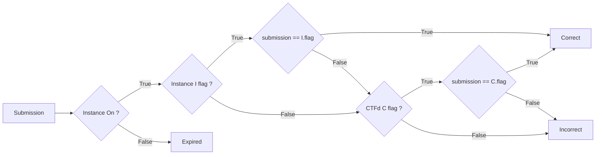

## Concept

Cheating is a part of competitions, especially cash-prize is involved. The player experience is particularly frustrating, so we try to minimize some of the common cases of cheating. 

We've concentrated on the two most common cases, namely *ShareFlag* and *FlagHolding*:
* *ShareFlag*: get or share flags with an another team.
* *FlagHolding*: store flags to submit them on the very last moment.

## How this work 

We redefine the `submit` method of the `dynamic_iac` challenge to verify the generated flag against the current source.

Here's the algorithm:

On the `submit` method, we get all informations of the instance on chall-manager.
1. We want the instance ON to prevent *FlagHolding* and make sure the submitted flag is the one in the instance.
2. We check if the instance define a flag (if you don't use the flag variation on the sdk).
3. If the instance define a flag, we check if the submission is correct.
4. If the instance does not define a flag or if the submission is incorrect, we check if a flag is defined on CTFd (also use as fallback).
5. Now, it is the classic behavior of CTFd.

## Conclusion
Addressing the shareflag issue is crucial to maintaining fairness in CTF competitions. By redefining the submission process with methods like the dynamic_iac challenge, we ensure that only legitimate efforts are rewarded, preserving the true spirit and integrity of the competition.

## FAQ

### Why don't we use the CTFd Flag system for generated flag ?
That's simple: if we generate the flag on CTFd, each team can submit any generated flag, which doesn't address the shareflag issue.

### Why must the instance be ON to submit?
There are two main reasons for this requirement:

1. To prevent *ShareFlag*: the instance must be up and running to retrieve the generated flag from chall-manager, ensuring flags are unique and not shared between participants.
2. To prevent *FlagHolding*: keeping the instance active forces players to consume their mana when submitting flags, encouraging continuous participation in the competition. Additionnaly, the generated flag is valid for a running instance and will be regenerated in case of recreation.

### Why the CTFd Flag is consider as "fallback" ?
As we said before, the CTFd Flag system allows users to submit the same flag. We use this system to prevent connection error or latency with chall-manager or if the generated flag is invalid for synthax error (we choose the extended ASCII so it should not happen).

