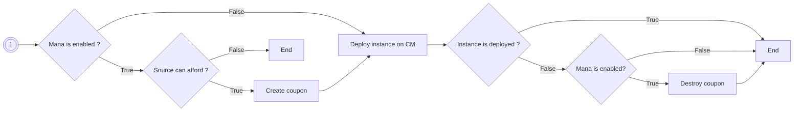

## Concept

As a CTF administrator, it's important to manage infrastructure resources such as VMs, containers, or Kubernetes Pods effectively. To avoid overloading the infrastructure by deploying excessive instances, we introduced a "mana" system that assigns a cost to each challenge.

For instance, consider these three challenges:
* **challenge1**: a static web server in the web category;
* **challenge2**: a Unix shell challenge in the pwn category;
* **challenge3**: a Windows server VM in the forensic category.

Challenge3 demands more resources than Challenge2, and Challenge2 requires more than Challenge1.

Suppose each team has a mana limit of 5, with the following costs assigned:

| Name          | Cost |
|---------------|------|
| challenge1    | 1    |
| challenge2    | 2    |
| challenge3    | 5    |

In this scenario, teams can deploy instances for Challenge1 and Challenge2 simultaneously but must remove both to deploy Challenge3.

Example:
* **Team 1**: Focused on pwn challenges, will likely prioritize deploying Challenge2.
* **Team 2**: Specializes in Windows forensics, making Challenge3 their main priority.

**This system helps administrators control the use of resources on CTF infrastructures.**

Combined with the [flag variation engine](/docs/chall-manager/challmaker-guides/flag-variation-engine/) feature of chall-manager, mana also helps minimize *Flag Holding*. To progress, players must submit flags and destroy instances to reclaim mana. If players choose to hoard flags until the last moment, mana limits their ability to continue, adding a strategic element to the competition.

## How it works

### Mana Total

To set the total mana available to users, go to the Settings section of the plugin and adjust the “Mana Total” field. By default, this feature is disabled with a value of 0. The total mana can be modified during the event without any impact on existing configurations.

### Mana Cost

Each `dynamic_iac` challenge is assigned a mana cost, which can be set to 0 if no cost is desired. Changes to mana costs can be made during the event, but previously issued coupons will retain the cost at the time of their creation.

### Coupons

When a user requests an instance, a coupon is generated as long as they have enough mana. Administrators can bypass restrictions and deploy instances directly through the admin panel, creating coupons without limits. Each coupon stores the *sourceId*, *challengeId*, and *challengeManaCost* at the time of creation.

## Example workflow
### Instance creation

Here an example of the usage of mana and the coupon creation while the instance create process:

Detailed process:
1. We check that *Mana Total* is greater than 0.
2. If mana is enable, we check that the Source can afford the current *Mana Cost*.
3. If Source cannot afford the instance, the process end.
4. If Source can afford, we create a coupon.
5. While the coupon is created, or the mana feature is disable, we create the instance on chall-manager.
6. We check that the instance is running on Chall-Manager.
7. If it's running correctly, we end the process.
8. If not, we destroy the coupon if exists, then end process with an error.

## Synchronicity

Due to the vital role of mana, we have to ensure its consistency: elseway it could be possible to brute-force the use of Chall-Manager to either run all possible challenges thus bypassing restrictions.

To provide this strict consistency, we implemented a Writer-preference Reader-Writer problem based upon Courtois _et al._ (1971) work. We model the problem such as administration tasks are Writers and players Readers, hence administration has priority over players.
For scalability, we needed a distributed lock system, and due to CTFd's use of Redis, we choosed to reuse it.

## FAQ

### Why aren't previous coupon prices updated?

We modeled the mana mechanism on a pricing strategy similar to retail: prices can fluctuate during promotions, and when an item is returned, the customer receives the price paid at purchase. This approach allows CTF administrators to adjust challenge costs dynamically while maintaining consistency.

### Why can administrators bypass the mana check?

During CTF events, administrators might need to deploy instances for users who have exhausted their mana. While coupons will still be generated and mana consumed, administrators can set the cost to 0 at the challenge level to waive the charge if needed.
