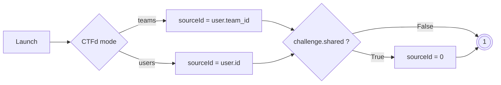

## Concept
As explained [here](/docs/chall-manager/glossary/#source), the *Source* refers to the team or user that initiates a request. This abstraction allows compatibility with CTFd operating in either “users” or “teams” mode, making the plugin versatile and usable in both modes.

To enable sharing across all users, the `sourceId` is set to `0`. The table below summarizes the different scenarios:

| user_mode | shared       | sourceId             |
|-----------|--------------|----------------------|
| users     | FALSE        | current_user.id      |
| teams     | FALSE        | current_user.team_id |
| users     | TRUE         | 0                    |
| teams     | TRUE         | 0                    |

## Example workflow
### Instance creation

Here an example of sourceId usage in the instance creation process:

The rest of the workflows is detailed in [mana](/docs/ctfd-chall-manager/design/mana) section.
