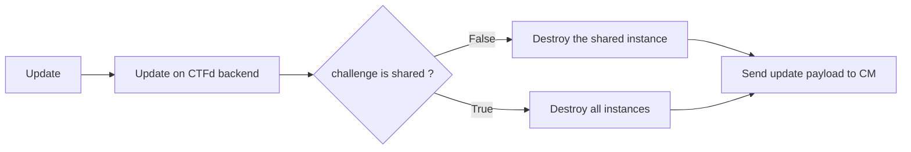

## Goal 
Here, we assume that you are a CTF administrator, the infrastructure is already configured and you understand the key concepts.
During or before your event you may need to change challenge attributes.

For all updates, go to the CTFd Admin Panel and edit the challenge (https://CTFD_URL/admin/challenges).

{}
{}

## Change the scope
When you arrive on the modification page, the value displayed is the one configured at the challenge level.

{}
{}

By editing this value, you trigger instances destruction, see workflow belows:

## Change the destroy on flag 
When you arrive on the modification page, the value displayed is the one configured at the challenge level.

{}
{}

You can edit this value at any time without any impact on Chall-Manager API.

## Change the mana cost
When you arrive on the modification page, the value displayed is the one configured at the challenge level.

{}
{}

By editing this value, you do not edit the existing coupons of this challenge. 
Also, you can organize sales periods.

## Change Timeout 
When you arrive on the modification page, the value displayed is the one configured at the challenge level.

{}
{}

You can change or reset this value, Chall-Manager will update all the computed `until` for instances. 

## Change Until 
When you arrive on the modification page, the value displayed is the one configured at the challenge level.

{}
{}

You can change or reset this value, Chall-Manager will update all the computed `until` for instances. 

## Change the scenario
When you arrive on the modification page, you can download the current scenario archive.

{}
{}

By editing this value, you need to provide an update strategy.

{}
{}

The update can be long, depends on the update gap and the strategy.
